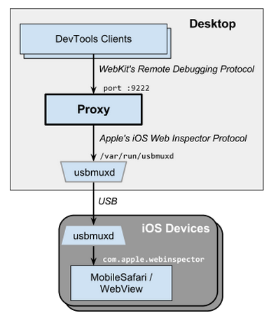

Google BSD license <http://code.google.com/google_bsd_license.html>
Copyright 2012 Google Inc.  <wrightt@google.com>

iOS WebKit Debug Proxy
======================

The ios_webkit_debug_proxy allows HTTP-based [WebKit Remote Debugging Protocol clients](https://developers.google.com/chrome-developer-tools/docs/remote-debugging) to inspect iOS web browsers (MobileSafari and UIWebViews) via Apple's [Remote Web Inspector service](https://developer.apple.com/technologies/safari/developer-tools.html).

The proxy listens on <http://localhost:9221> for requests to list attached iOS devices, which are automatically assigned HTTP ports starting at 9222.  The user can click on a device's link (e.g. <http://localhost:9222>) to list that device's open tabs, then click on a tab link (e.g. <http://localhost:9222/devtools/page/1>) to inspect that tab in the browser's DevTools UI.

Equivalent JSON-formatted APIs are provided for automated clients: <http://localhost:9221/json> to list all devices,    <http://localhost/9222/json> to list device ":9222"'s tabs,    and [ws://localhost:9222/devtools/page/1]() to inspect a tab.  An example client is provided in [examples/wdp_client.js]().

Requirements
------------

Linux and OS X are currently supported.  Windows support is planned but not implemented yet.

The proxy requires the following open-source packages:

   - [libplist](http://cgit.sukimashita.com/libplist.git)
   - [libusbmuxd](http://cgit.sukimashita.com/libusbmuxd.git)
   - [libimobiledevice](http://cgit.sukimashita.com/libimobiledevice.git)

The above packages can also be installed using apt-get:

      sudo apt-get install libusb-dev libusb-1.0-0-dev
      sudo apt-get install libplist-dev libplist++-dev
      sudo apt-get install usbmuxd

On Linux you must run the `usbmuxd` daemon.  The above install typically adds a udev rule to start the daemon whenever a device is attached.

Installation
------------
     ./autogen.sh
     ./configure           # for debug symbols, append 'CFLAGS=-g -O0'
     make
     sudo make install

Usage
-----
Start the debugger by running:

       ios_webkit_debug_proxy

Press Ctrl-C to quit. The debugger can be left running as a background process.  Add "-d" for verbose output.

Configuration
-------------
The device_id-to-port assignment defaults to:

      :9221 for the device list
      :9222 for the first iOS device that is attached
      :9223 for the second iOS device that is attached
      ...
      :9322 for the max device
      
If a port is in use then the next available port will be used, up to
the range limit.

The port assignment is first-come-first-serve but is preserved if a device
is detached and reattached, assuming that the debugger is not restarted, e.g.:

  1. start the debugger
  1. the device list gets :9221
  1. attach A gets :9222
  1. attach B gets :9223
  1. detach A, doesn't affect B's port
  1. attach C gets :9224 (not :9222)
  1. reattach A gets :9222 again (not :9225)

The assignment rules can be set via the command line.  The default is
equivalent to:

      ios_webkit_debug_proxy -c :9221-9322

Each comma-separated item must match:

      [40-char-hex or "*" or "null"] [" " or ":""] min_port[-max_port]

where "null" represents the device list and "*" is the same as "".
Here are some examples:

      # monitor a specific device
      ios_webkit_debug_proxy -c 4ea8dd11e8c4fbc1a2deadbeefa0fd3bbbb268c7:9227
      
      # monitor all devices but disable the device list
      ios_webkit_debug_proxy -c null:-1,:9300-9400
      
To read lines from a config file, use "-c FILENAME".

Source
------

- [src/ios_webkit_debug_proxy_main.c]()   
   \- The "main"   

- [src/ios_webkit_debug_proxy.c]()    
   \- WebInspector to WebKit Remote Debugging Protocol translator   
   \- See [examples/wdp_client.js]() and [http://localhost:9221]()   

- [src/webinspector.c]()   
   \- iOS WebInspector library   
   \- See [examples/wi_script.c]()   

- [src/device_listener.c]()   
   \- iOS device add/remove listener   
   \- See [examples/dl_client.c]()   

- [src/websocket.c]()   
   \- A generic WebSocket library   
   \- Uses base64.c and sha1.c from [PolarSSL](http://www.polarssl.org)   
   \- See [examples/ws_echo1.c]() and [examples/ws_echo2.c]()   

- Utilities:   
   \- [src/char_buffer.c]() byte buffer   
   \- [src/hash_table.c]() dictionary   
   \- [src/port_config.c]() parses device_id:port config files   
   \- [src/socket_manager.c]() select-based socket controller   

Design
------

The high-level design is shown below:

The various clients are shown below:

The major components of the ios_webkit_debug_proxy are:

  1. A device_listener that listens for iOS device add/remove events
  1. A (port, webinspector) pair for each device, e.g.:   
     - [(port 9222 <--> iphoneX's inspector),
     -  (port 9223 <--> iphoneY's inspector), ...]
  1. Zero or more active WebSocket clients, e.g.:
     - [websocketA is connected to :9222/devtools/page/7, ...]
  1. A socket_manager that handles all the socket I/O

The code is object-oriented via the use of structs and function pointers.
For example, the device_listener struct defines two "public API" functions:

    dl_status (*start)(dl_t self);
    dl_status (*on_recv)(dl_t self, const char *buf, );

and three "abstract" callback functions:

    dl_status (*send)(dl_t self, const char *buf, size_t length);
    dl_status (*on_attach)(dl_t self, const char *device_id);
    dl_status (*on_detach)(dl_t self, const char *device_id);

plus a field for client use:

    void *state;

For example, [examples/dl_client.c]() creates a listener and sets the missing callbacks:

    int fd = dl_connect();
    dl_t dl = dl_new(); // sets the "start" and "on_recv" functions
    dl->state = fd;     // for use by "my_send"
    dl->send = my_send; // --> send((int)dl->state, buf, length);
    dl->on_attach = my_on_attach; // --> printf("%s", device_id);
    dl->on_detach = my_on_detach; // --> ditto

then does:

    dl->start();

Lastly, the client forwards all socket input to the listener's "on_recv"
handler:

    char buf[1024];
    while (1) {
       int len = recv(fd, buf, 1024);
       if (dl->on_recv(dl, buf, len)) break;
    }

where "on_recv" buffers the input and calls our "my_on_message" when it has a
full message.

Note that the "on_recv" and "send" functions abstract the I/O from the
interface, which simplifies debugging and unit testing.

The detailed design is shown below:

Lines in red are controlled by the main "ios_webkit_debug_proxy".  For example, although the figure shows a direct red line from the socket_manager's "on_recv" to the ios_webkit_debug_proxy's handler, this is implemented as a callback through ios_webkit_debug_proxy_main's "iwdpm_on_recv(...)".  This design isolate the components from one another and simplifies both offline and per-component unit testing.

The code is single-threaded and uses non-blocking I/O.  Instead of having a thread per socket that does blocking reads, the single  socket_manager's non-blocking select forwards data to the "on_recv" function of websocket/webinspector/etc.  This improves system scalability and makes it easier to debug and unit test.

